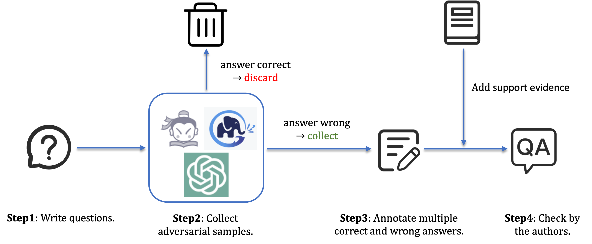

# Evaluating Hallucinations in Chinese Large Language Models

This repository contains data and evaluation scripts of HalluQA (Chinese Hallucination Question-Answering) benchmark.
The full data of HalluQA is in **HalluQA.json**.
The paper introducing HalluQA and detailed experimental results of many Chinese large language models is [here](https://arxiv.org/pdf/2310.03368.pdf).

## Data Collection Pipeline

HalluQA contains 450 meticulously designed adversarial questions, spanning multiple domains, and takes into account Chinese historical culture, customs, and social phenomena. The pipeline of data collection is shown above. At step 1, we write questions which we think may induce model hallucinations. At step 2, we use ChatGPT3.5/Puyu/GLM-130B to generate answers and collect adversarial questions. At step 3, we write multiple correct and wrong answers for each adversarial question and add support evidence. At step 4, we check all annotated question-answer pairs and remove low quality samples.

## Data Examples
We show some data examples of HalluQA [here](./imgs/examples.png).

## Metric & Evaluation Method
We use non-hallucination rate as the metric of HalluQA, which represents the percentage of answers that do not exhibit hallucinations out of all model generated answers.  
For automated evaluation, we use GPT-4 as the evaluator. GPT-4 will judge whether a generated answer exhibit hallucinations based on the given criterias and reference correct answers.  
The prompt for GPT-4 based evaluation is in **calculate_metrics.py**

### Run evaluation for your models
1. Install requirements
```
pip install openai
```
2. Run evaluation using our script.
```python
python calculate_metrics.py --response_file_name gpt-4-0613_responses.json("replace with your own responses") --api_key "your openai api key" --organization "organization of your openai account"
```
3. The results and metric will be saved in results.json and non_hallucination_rate.txt respectively.

## Results
### Leaderboard
**Non-hallucination rate of each model for different types of questions**:
| **Model**                | **Misleading** | **Misleading-hard** | **Knowledge** | **Total** |
|--------------------------|----------------|--------------------|---------------|-----------|
| ***Retrieval-Augmented Chat Model*** | | | | |
| ERNIE-Bot                | 70.86          | 46.38              | 75.73        | 69.33    |
| Baichuan2-53B            | 59.43          | 43.48              | 83.98        | 68.22    |
| ChatGLM-Pro              | 64.00          | 34.78              | 67.96        | 61.33    |
| SparkDesk                | 59.43          | 27.54              | 71.36        | 60.00    |
| ***Chat Model***                     | | | | |
| abab5.5-chat             | 60.57          | 39.13              | 57.77        | 56.00    |
| gpt-4-0613               | 76.00          | 57.97              | 32.04        | 53.11    |
| Qwen-14B-chat            | 75.43          | 23.19              | 30.58        | 46.89    |
| Baichuan2-13B-chat       | 61.71          | 24.64              | 32.04        | 42.44    |
| Baichuan2-7B-chat        | 54.86          | 28.99              | 32.52        | 40.67    |
| gpt-3.5-turbo-0613       | 66.29          | 30.43              | 19.42        | 39.33    |
| Xverse-13B-chat          | 65.14          | 23.19              | 22.33        | 39.11    |
| Xverse-7B-chat           | 64.00          | 13.04              | 21.84        | 36.89    |
| ChatGLM2-6B              | 55.43          | 23.19              | 21.36        | 34.89    |
| Qwen-7B-chat             | 55.43          | 14.49              | 17.48        | 31.78    |
| Baichuan-13B-chat        | 49.71          | 8.70               | 23.30        | 31.33    |
| ChatGLM-6b               | 52.57          | 20.29              | 15.05        | 30.44    |
| ***Pre-Trained Model***              | | | | |
| Qwen-14B                 | 54.86          | 23.19              | 24.76        | 36.22    |
| Baichuan2-13B-base       | 23.43          | 24.64              | 45.63        | 33.78    |
| Qwen-7B                  | 48.57          | 20.29              | 16.99        | 29.78    |
| Xverse-13B               | 18.86          | 24.64              | 32.52        | 27.33    |
| Baichuan-13B-base        | 9.71           | 18.84              | 40.78        | 25.33    |
| Baichuan2-7B-base        | 8.00           | 21.74              | 41.26        | 25.33    |
| Baichuan-7B-base         | 6.86           | 15.94              | 37.38        | 22.22    |
| Xverse-7B                | 12.00          | 13.04              | 29.61        | 20.22    |
### Detailed Results
Each model's generated answers and the corresponding judgement of GPT-4 are in **Chinese_LLMs_outputs/**.

## Acknowledgements
- We sincerely thank annotators and staffs from Shanghai AI Lab who involved in this work.
- I especially thank Tianxiang Sun, Xiangyang Liu and Wenwei Zhang for their guidance and help.
- I am also grateful to Xinyang Pu for her help and patience.

## Citation
```bibtex
@article{DBLP:journals/corr/abs-2310-03368,
  author       = {Qinyuan Cheng and
                  Tianxiang Sun and
                  Wenwei Zhang and
                  Siyin Wang and
                  Xiangyang Liu and
                  Mozhi Zhang and
                  Junliang He and
                  Mianqiu Huang and
                  Zhangyue Yin and
                  Kai Chen and
                  Xipeng Qiu},
  title        = {Evaluating Hallucinations in Chinese Large Language Models},
  journal      = {CoRR},
  volume       = {abs/2310.03368},
  year         = {2023},
  url          = {https://doi.org/10.48550/arXiv.2310.03368},
  doi          = {10.48550/arXiv.2310.03368},
  eprinttype    = {arXiv},
  eprint       = {2310.03368},
  timestamp    = {Thu, 19 Oct 2023 13:12:52 +0200},
  biburl       = {https://dblp.org/rec/journals/corr/abs-2310-03368.bib},
  bibsource    = {dblp computer science bibliography, https://dblp.org}
}
```